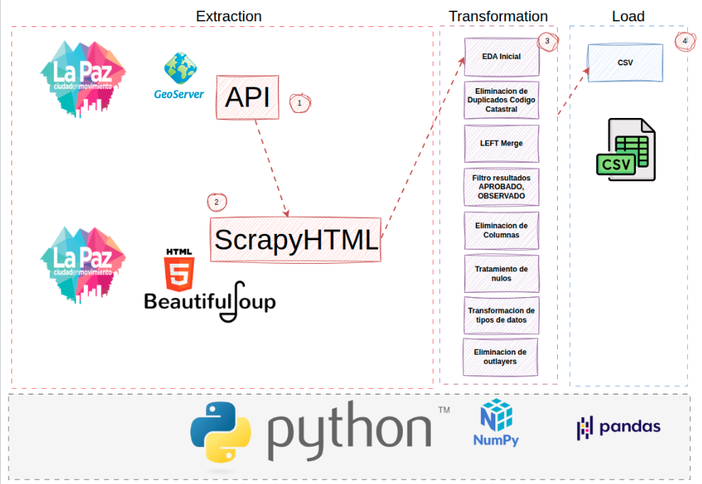

<!-- omit in toc -->
# 🏗️ Proyecto: ETL y Validación de Calidad de Datos – Trámites Municipales de La Paz

> ⚠️ **Nota Académica:**  
> Este proyecto es de carácter **experimental** y forma parte del **Módulo 7 – Adquisición y Comprensión de Datos** de la **Maestría en Inteligencia Artificial y Data Science para la Transformación de Negocios (MIADAS 2)**,  
> orientado al aprendizaje práctico de procesos **ETL, calidad de datos y orquestación con Airflow**.


<!-- omit in toc -->
## Tabala de contenidos
- [👥 Integrantes (Grupo 2)](#-integrantes-grupo-2)
- [📁 Estructura del Repositorio](#-estructura-del-repositorio)
- [🎯 Objetivo del Proyecto](#-objetivo-del-proyecto)
- [🧭 Diagrama del Flujo ETL](#-diagrama-del-flujo-etl)
- [📦 Entregables](#-entregables)
- [🔍 Descripción de los Notebooks](#-descripción-de-los-notebooks)
- [⚙️ Pipeline Airflow](#️-pipeline-airflow)
  - [Estructura del flujo:](#estructura-del-flujo)
- [📊 Reporte de Calidad](#-reporte-de-calidad)
- [🧩 Herramientas y Librerías](#-herramientas-y-librerías)
- [🏗️ Arquitectura Propuesta](#️-arquitectura-propuesta)
- [📘 Referencias](#-referencias)


## 👥 Integrantes (Grupo 2)
- **Ericka Cori**  
- **Paolo Ramos**  
- **Gaston Nina**

---

## 📁 Estructura del Repositorio

```
.
├── data/
│   ├── df_modelo_limpio_1.csv
│   ├── tramites_html_identificador.csv
│   └── tramites_lapaz_api_identificador.csv
│
├── diccionario/
│   ├── Diccionario de Datos.pdf
│   └── Diccionario de Datos.xlsx
│
├── notebooks/
│   ├── mod_07_Scrapy.ipynb
│   ├── mod_07_transformacion.ipynb
│   └── mod_07_QUALITY.ipynb
│
├── pipeline_airflow/
│   └── dags/
│   ├── tramites_lapaz_extract.py
│   ├── tramites_lapaz_pipeline.py
│   ├── tramites_lapaz_report.py
│   └── tramites_lapaz_transform.py
│
├── reporte_de_calidad/
│   └── quality_report.html
│
├── INFORME FINAL.pdf
├── Presentacion.pdf
└── README.md
```

---

## 🎯 Objetivo del Proyecto

El objetivo es desarrollar un **pipeline ETL completo** para los datos de trámites municipales del Gobierno Autónomo Municipal de La Paz, aplicando técnicas de:
- **Extracción** mediante scraping y APIs.
- **Transformación y limpieza** de datos.
- **Validación de calidad** con herramientas como *Great Expectations*.
- **Orquestación** mediante *Apache Airflow*.


## 🧭 Diagrama del Flujo ETL

El siguiente diagrama resume las etapas principales del proceso **ETL (Extract, Transform, Load)** aplicadas sobre los datos municipales:



**Descripción general:**
1. **Extracción:** datos obtenidos desde la API del GeoServer municipal y páginas HTML mediante *BeautifulSoup* y *Scrapy*.  
2. **Transformación:** limpieza, unión, eliminación de duplicados y tratamiento de nulos.  
3. **Carga:** exportación de los resultados a archivos CSV para análisis y validación de calidad.  
4. **Tecnologías:** desarrollo en *Python* con librerías como *NumPy* y *Pandas*.


## 📦 Entregables

| Entregable | Descripción |
|-------------|--------------|
| **Código fuente** | Repositorio estructurado con [notebooks](notebooks/) y [scripts base para migración a Airflow](pipeline_airflow/dags/). |
| **Dataset limpio generado** | Archivo [`df_modelo_limpio_1.csv`](data/df_modelo_limpio_1.csv) con los registros depurados y transformados. |
| **Diccionario de datos** | Descripción de las variables, tipos y significados en [`Diccionario de Datos.xlsx`](diccionario/Diccionario%20de%20Datos.xlsx). |
| **Data Quality Report** | Reporte automático de calidad generado con *Great Expectations* y *pandas-profiling*: [`quality_report.html`](reporte_de_calidad/quality_report.html). |
| **Pipeline orquestado** | Flujo ETL implementado en [`pipeline_airflow/dags/`](pipeline_airflow/dags/). |
| **Arquitectura propuesta** | Documento principal del proyecto: [`INFORME FINAL.pdf`](INFORME%20FINAL.pdf). |


---

## 🔍 Descripción de los Notebooks

| Notebook | Descripción |
|-----------|-------------|
| `mod_07_Scrapy.ipynb` | Extracción de datos desde HTML y API municipal. |
| `mod_07_transformacion.ipynb` | Limpieza, normalización y unión de datasets. |
| `mod_07_QUALITY.ipynb` | Validación de calidad con *pandas-profiling* y *Great Expectations*. |

---

## ⚙️ Pipeline Airflow

La carpeta `pipeline_airflow/dags/` contiene los **DAGs** que replican y automatizan el flujo de los notebooks mediante **Apache Airflow**.

### Estructura del flujo:
1. **Extracción:** obtención de datos desde fuentes HTML y API.
2. **Transformación:** limpieza, estandarización y unión de datasets.
3. **Validación de calidad:** expectativas automáticas con *Great Expectations*.
4. **Reporte:** generación de informes HTML y dataset final.

> **💡 Importante:**
> Para que Airflow ejecute correctamente los flujos, copia la carpeta `pipeline_airflow/dags/` dentro del directorio `dags` de tu instalación de Airflow, por ejemplo:
> ```
> ~/airflow/dags/
> ```


---

## 📊 Reporte de Calidad

Se generó automáticamente usando **pandas-profiling / ydata-profiling** y **Great Expectations**, validando:
- Valores nulos, duplicados y rangos esperados.
- Consistencia de latitud/longitud.
- Relación entre superficie legal y construida.

El reporte está disponible en:
```
reporte_de_calidad/quality_report.html
```

---

## 🧩 Herramientas y Librerías

- **Python 3.12+**
- **Pandas**, **NumPy**
- **BeautifulSoup4**, **Requests**
- **Great Expectations**
- **Apache Airflow**

---

## 🏗️ Arquitectura Propuesta

El diseño sigue la arquitectura típica de un pipeline ETL:

```
[Extracción] --> [Transformación y Limpieza] --> [Validación de Calidad] --> [Carga y Reporte]
       |                    |                          |                         |
   Scrapy/API           Pandas/Polars          Great Expectations       HTML/CSV Output
```

El flujo será orquestado por **Apache Airflow**, asegurando reproducibilidad, trazabilidad y monitoreo de cada etapa.

---

## 📘 Referencias

- [Great Expectations Documentation](https://docs.greatexpectations.io/)
- [Pandas Profiling / YData Profiling](https://ydata-profiling.ydata.ai/docs/master/)
- [Apache Airflow](https://airflow.apache.org/)